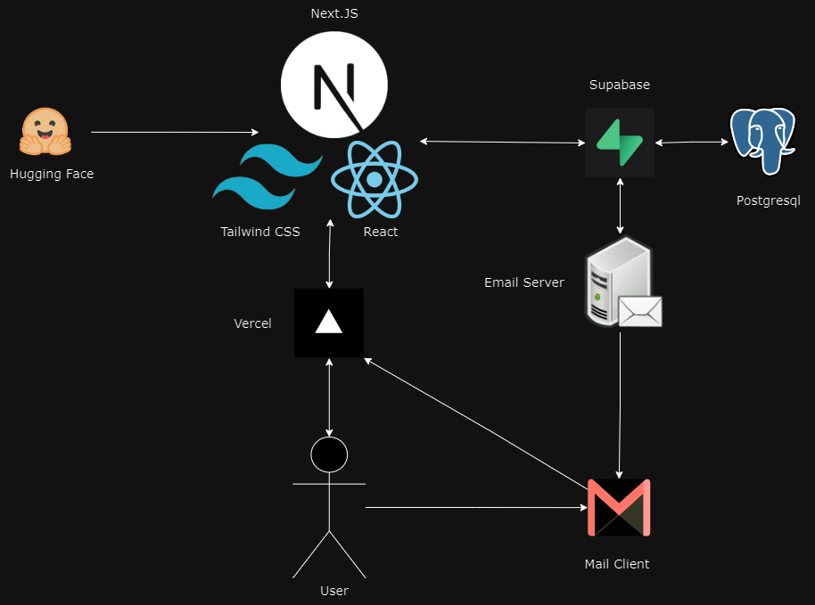

# FitFinder
### FitFinder is a fitness-oriented application that connects users and trainers, offering a seamless interface for interaction and personal training needs. This application is hosted on [fitfinder.ca](https://fitfinder.ca/). Built with NextJS, TailwindCSS, and Supabase as the backend, FitFinder is deployed with Vercel.

[](https://fitfinder.ca/)


# Table of Contents
[Features](#features)  
[Technologies Used](#technologies-used)  
[Getting Started](#getting-started)  
[Project Structure](#project-structure)  
[Contributing](#contributing)

# Features
FitFinder comes with a wide array of features that streamline the user experience for both trainers and fitness enthusiasts:

**User Accounts**: Create accounts, sign in, and recover forgotten passwords seamlessly.

**Trainer Creation**: Easily set up a new trainer profile.

**Rich Media**: Add and sort images within a trainer's profile.

**Trainer Discovery**: Find trainers that suit your needs and preferences, and interact with their profile modals for more information.

**Interactive Interface**: Like your favorite trainers to show your support or bookmark for later.

### Additional Features

**Ratings and Comments**:
- Users can rate trainers and leave feedback, helping the community make informed decisions.
- A built-in moderation system ensures that the platform remains spam-free and upholds a high standard of communication.

**NSFW Image Checker**: 
- An automated tool reviews uploaded images to ensure they meet the platform's standards and guidelines.

**Toxic Comment Checker**: 
- To promote a healthy and respectful community, this tool automatically identifies and flags potentially harmful comments.

**Tag Filtration & Suggestions**: 
- Improve your search experience with tag filtration, allowing users to find trainers based on specific categories like 'strength training', 'yoga', and more.
- The platform also auto-suggests tags derived from the trainer's biography, streamlining profile setup and enhancing discoverability.

# Technologies Used
This project is implemented with the following technologies:
* Next.js
* Tailwind CSS
* Supabase
* Vercel

* Hugging Face

# Getting Started
To get a local copy up and running, follow these simple steps:

Clone the repository

```bash
git clone https://github.com/FitFinderHost/FitFinder.git
```
Install the dependencies

Navigate into the project directory and run:
```bash
npm install
#or with yarn     
yarn install
```

Start the development server:
```bash
npm run dev
or with yarn
yarn dev
```
Open http://localhost:3000 with your browser to see the result.

# Project Structure
Here's a high-level overview of the project's structure:

    ├── public/             # All static resources
    ├── lib/                # Supabase helper
    ├── src/
    │   |── app/
    │   │   ├── api/        # API handlers
    │   │   ├── auth/       # Auth helpers
    │   │   ├── components/ # UI Components 
    │   │   ├── profile/    # profile information
    │   │   ├── utils/      # supabase client
    ├── package.json        # Project meta data
    ├── .gitignore          # Ignore file for git
    ├── README.md           # This file

# Contributing
Thank you for your interest in contributing to FitFinder. We welcome contributions from everyone.

With FitFinder, finding the perfect trainer for your fitness journey has never been easier. We hope you enjoy using our application as much as we enjoyed building it!
